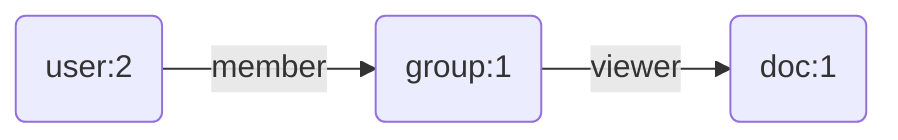
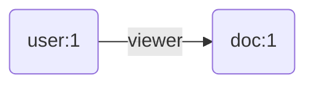
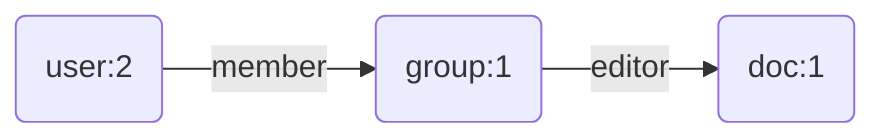
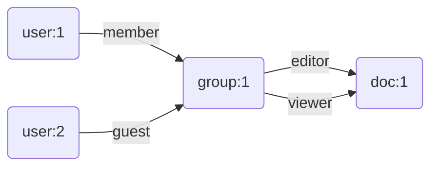
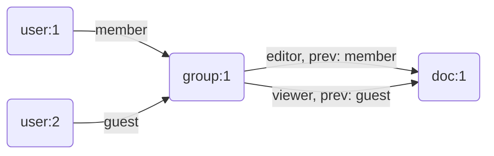

# Simple ReBAC using Postgres and Apache AGE

All I wanted was a simple check method. Given a user, an object, and the relation to that object and return a boolean describing if the user has that relation to the object.

Since the [Zanibar paper](https://zanzibar.tech/) was published in 2019 multiple services have popped up: [SpiceDB](https://authzed.com/spicedb), [Keto](https://www.ory.sh/keto/), [Oso](https://www.osohq.com/cloud/authorization-service), [Permify](https://permify.co/), and even [Auth0](https://auth0.com/fine-grained-authorization)'s fine-grained authorization product. These SaaS solutions are all paid or self-hosted external services.

But I wanted a simple postgres based authorization solution for my simple monolithic application. I was already using [AuthJS](https:/authjs.dev) for authentication and postgres for storing my application data. Role based access control is rather limited. And I wanted clear separation between the data model for my application and its permissions. In the past I've used libraries at the application layer to handle authorization that integrate direcly with my data model.

A postgres solution must be possible. SpiceDB and Keto both have postgres as storage options. Yet the only hits I found on Github for Zanzibar/ReBAC were proof of concepts ([zanzibar-pg](https://github.com/josephglanville/zanzibar-pg), [pgzan](https://github.com/brahmlower/pgzan)) that didn't quite fit my use case. Most early applications implement their own permissions using a library in the application layer without an external service, yet a ReBAC solution didn't exist for NodeJS and postgres, one of the most popular setups in 2024.

## Zanzibar Features

As far as I can tell there are three basic components of Zanzibar:
1. Relations: Object-User and Object-Object
2. Relation Configurations: described as [userset rewrites](https://zanzibar.tech/#annotations/intro/rewrites-are-important) in the paper
3. Check: Determine if a user is authorized to perform an action on an object (read, write, etc.)

There's also the ability to return a collection of objects a user can operate on, but all I wanted was a simple check method for a single object to start.

User-Object relations are described as [tuples](https://zanzibar.tech/#annotations/intro/no-user-user) in the format `<namespace>:<object_id>#<relationship>@<user_id>`. Here's an example of a Object-User relation:
```
doc:1#editor@1
group:1#member@2
```

This states that the user with id 1 is an editor of the document with id 1. The user with id 2 is a member of the group with id 1.

Object-Object relations are described in the format `<namespace>:<object_id>#<relationship>@<namespace>:<object_id>#<relationship>`. For example, a member of group 1 is a viewer of the document with id 1 would be represented as:
```
doc:1#viewer@group:1#member
```

Resulting in User 1 having the ability to edit Document 1 and User 2 to view the document.

## Representing Permission Checks as Graphs

User-Object checks are simple and straight forward. Checking if a user is authorized through an Object-Object is a bit more complex. If modeled through a postgres table of tuples it would require recursively joining objects to check if the user has access to the target object.

Graph databases are designed to handle this kind of query, especially when more objects are added to the chain.

Here's a graph that describes User 2's relationship to the Document:


[Apache AGE](https://age.apache.org/) is a graph database extension for postgres. In addition to efficiently handling graph traversal it also provides the [cypher query language](https://neo4j.com/docs/cypher-manual/current/queries/concepts/) to express queries more naturally.

Here's a simple cypher query that checks if there is path between User 2 and Document 1:

```cypher
MATCH (User {id: 2})-[*]->(Document {id: 1});
```

Nodes (also called a vertices in graph terminology) are written with `()` syntax and relationships are written with `-[]-` syntax which may be directional using angle brackets as shown. Each node or vertex can have properties which are written with `{}` syntax.

In this case the `*` denotes any number of relationships and any number of relationship types. In this setup we have two different kinds of objects: `User` and `Document`. However, we'll need something more generic to describe any type of object.

In Zanzibar's paper they describe objects with `<namespace>:<id>` syntax. We can use the `namespace` property on an object node (aka. vertex) to describe the type of object.

```cypher
MATCH (User {id: 2})-[*]->(Object {id: 1, namespace: "doc"});
```

However, this isn't nearly enough to describe relations with enough specificity to perform a check with a the interface we desire.

What if we check if User 2 can edit Document 1? This cypher query will still find a path between the two objects because this query ignores relationship types.

## A Simple User-Object Permission Check

To take this first step of checking relationship types, consider an even simpler graph:



This describes a User-Object relationship where User 1 is a viewer of Document 1.

To perform a check to see if the user can view the document we can use the following cypher query:

```cypher
MATCH (User {id: 1})-[:viewer]->(Object {id: 1, namespace: "doc"});
```

Instead of using `*` we can use the `[:label]` syntax (a label is also the relationship type) to check for a specific relationship type, in this case "viewer". To check if the User can edit the Document:
```cypher
MATCH (User {id: 1})-[:editor]->(Object {id: 1, namespace: "doc"});
```

The `MATCH` clause will return 0 matches since the only relationship between the User and Object are of type "viewer".

An astute reader may notice that we'd like for an editor of the document to also be a viewer of a document. We'll address this later on with the userset rewrites feature set mentioned earlier.

## A Simple Object-Object Permission Check

Now let's take it a step further and examine a permission check that includes an Object-Object relationship to the mix.

Consider the following graph:


To check the permission that User 2 has relative to Document 1 we can check the last relationship in the path. This cypher query assigns the entire path to the `path` variable and checks the type of the last  relationship in the path.

```cypher
MATCH path = (User {id: 2})-[*]->(Object {id: 1, namespace: "doc"})
WHERE type(last(relationships(path))) = 'editor';
```

If we were to substitute 'editor' with 'viewer' the query would return no matches. This is great progress! However, this isn't enough to perform an accurate check.

To understand why let's consider the following set of relationships:

```
group:1#member@1
group:1#guest@2
doc:1#editor@group:1#member
doc:1#viewer@group:1#guest
```

Here, we have two users. User 1 is a member of Group 1 and User 2 is a guest of Group 1. Members of Group 1 can edit the document and Guests of group 1 can only view the document.

This produces the following graph:


Our cypher query only checks the last relationship in the path. User 2 has a relationship to Group 1 which has a relationship to Document 1 with the "editor" label so a match will be found implying that User 2 can edit the document!

To solve this we need to compare each relationship type against the previous relationship in the path, requiring us to store more information from the Object-Object relationship tuple in the graph. Adding a property to each Object-Object relationship describing the previous relationship's type enables the desired comparison.



Now each Object-Object relationship knows the previous relationship type to specify valid paths. In this case the "editor" relationship between Group 1 and Document 1 applies only to members of Group 1. Similarly, the "viewer" relationship between Group 1 and Document 1 applies to guests of Group 1.

Here's the cypher query that checks if User 2 can edit Document 1:

```cypher
MATCH path = (User {id: 2})-[*]->(Object {id: 1, namespace: "doc"})
WITH relationships(path) AS rels, size(relationships(path)) AS rels_size, last(relationships(path)) AS last_rel
WHERE type(last_rel) = 'editor'
UNWIND range(0, rels_size - 2) AS i
WITH rels[i] AS prev_rel, rels[i+1] AS next_rel, rels_size
WHERE type(prev_rel) = next_rel.prev
WITH count(1) AS valid_steps, rels_size
WHERE valid_steps = rels_size - 1
```

This became significantly more complex! We need to gather all the relationships in the path, the number of relationships, and the last relationship. For performance reasons we'll check that the last relationship is of the desired type and throw out all other paths. Then for the remaining paths we need to `UNWIND` each step of the path to compare the relationship type of each step to the previous step. Only those paths where every step is valid should be returned.

Each time we define a new variable using the `WITH` keyword we need to pass along any previously defined variables we want to use later in the query.

Albeit more complicated this does exactly what we want. Our check method only needs to specify the last relationship in the path and all intermediate relationships are checked appropriately given the description of tuples at the beginning of this section.

But what if we want 'members' of the group to also be 'viewers' of the document?

## Userset Rewrites

For any given relationship we may want certain types to behave as if they are another type. For example an "editor" of a document should also be a "viewer" of that document or for an "admin" of a group to also be a "member" of a group. This is where userset rewrites come in to play.

To specify this we need to know the object we're specifying the relationship for and all the relationships that are impled by a given relationship. This can be described in a simple YAML file.

```yaml
doc:
  viewer: viewer | editor
  editor: editor
group:
  member: member | admin
  admin: admin
```

The `|` syntax is used in TypeScript to describe a union of types. Although we'll need to parse this file for our purposes before using it, it's a simple and easy to read format for userset rewrite configuration purposes.

But how can we use this information in our cypher queries?

Cypher allows us to also use a `|` operator in relationships. To illustrate consider a simple User-Object relationship where an editor of a document is also a viewer of the document.

```cypher
MATCH (User {id: 1})-[:editor|viewer]->(Object {id: 1, namespace: "doc"})
```

An approach to userset rewrites is to expand the relationship type to all the types that it represents and check if there's any relationship that matches any of the expanded relationship types.

The contents of the parsed YAML file can be loaded into the properties of a single node in the graph database which can then be matched and treated as a key-value store for the purposes of substitution in our query. 

The above contents were parsed into the following format and then loaded into a node called Userset:
```
{
  'doc.viewer': ['viewer', 'editor'],
  'doc.editor': ['editor'],
  'group.member': ['member', 'admin'],
  'group.admin': ['admin']
}
```

In the `WITH` clause the familiar `IN` operator can be used to check if a value is contained in a list of values.

Here's the updated query for a simple User-Object permission check:

```cypher
MATCH (us:Userset)
MATCH (User {id: 2})-[r]->(o:Object {id: 1, namespace: "doc"})
WHERE type(r) IN us[o.namespace + '.' + 'viewer'];
```

In this query we're adding references for the nodes matched Userset and Object using the `(<variable>:<object>)` syntax. Properties are typically refrenced using the `.` syntax, for example `o.namespace` is referring to the `namespace` property of the `o` Object node. However, we can also use the `[]` syntax to reference properties of nodes, where `o['namespace']` would return the same result.

These are combined in the `WHERE` statement. `us[o.namespace + '.' + 'viewer']` resolves to `us['doc.viewer']` which returns `['viewer', 'editor']`. Now the path will be returned if the relationship for the Document object is either 'viewer' or 'editor' when we perform a check for 'viewer'.

Now for the more complex Object-Object case. Here's the cypher query:

```cypher
MATCH (us:Userset)
MATCH path = (User {id: 2})-[*]->(o:Object {id: 1, namespace: "doc"})
WITH us, o, nodes(path) AS ns, relationships(path) AS rels, size(relationships(path)) AS rels_size, last(relationships(path)) AS last_rel
WHERE type(last_rel) IN us[o.namespace + '.' + 'viewer']
UNWIND range(0, rels_size - 2) AS i
WITH us, ns[i+1] AS n, rels[i] AS prev_rel, rels[i+1] AS next_rel, rels_size
WHERE type(prev_rel) IN us[n.namespace + '.' + next_rel.prev]
WITH count(1) AS valid_steps, rels_size
WHERE valid_steps = rels_size - 1
```

One callout here is that this query refers to the namespaces of nodes in addition to the previous relationship type.

Now we have a working permission check for a simple ReBAC system. Now all we need to do is create a function that parameterizes the hard coded values for user ID, object ID, object namespace, and relationship type.

## The Check Function

User Defined Functions (UDFs) in postgres allow us to write the SQL once and store it in the database. This makes adding clients for different languages easier since merely needs to call the UDF and pass in appropriate arguments.

This function combines SQL and Cypher syntax, interpolates arguments SQL's `%s` and `%L` for unquoted and quoted strings. `$$` and `$<name>$` is used to define strings to avoid single quote escaping issues.

Here is the function in full:
```sql
CREATE OR REPLACE FUNCTION check_user_access(
  p_user_id INT, 
  p_object_id INT, 
  p_object_type TEXT, 
  p_final_relationship TEXT
)
RETURNS BOOLEAN AS $func$
DECLARE
  result BOOLEAN := FALSE;
  graph_name TEXT := 'rebac_graph';
  cypher_query TEXT;
BEGIN
  cypher_query := format($fmt$
    MATCH (us:Userset)
    MATCH (u:User {user_id: %s})-[r]->(o:Object {object_id: %s, namespace: %L})
    WHERE type(r) IN us[o.namespace + '.' + %L]
    RETURN true
    LIMIT 1
  $fmt$,
  p_user_id, p_object_id, p_object_type, p_final_relationship);

  EXECUTE format($exec$
    SELECT EXISTS (
      SELECT 1 FROM cypher(%L, $$%s$$) AS (result agtype)
    )
  $exec$, graph_name, cypher_query)
  INTO result;

  IF result THEN
    RETURN TRUE;
  END IF;

  cypher_query := format($fmt$
    MATCH (us:Userset)
    MATCH path = (User {user_id: %s})-[*]->(o:Object {object_id: %s, namespace: %L})
    WITH us, o, nodes(path) AS ns, relationships(path) AS rels, size(relationships(path)) AS rels_size, last(relationships(path)) AS last_rel
    WHERE type(last_rel) IN us[o.namespace + '.' + %L]
    UNWIND range(0, rels_size - 2) AS i
    WITH us, ns[i+1] as n, rels[i] as prev_rel, rels[i+1] AS next_rel, rels_size
    WHERE type(prev_rel) IN us[n.namespace + '.' + next_rel.relation]
    WITH count(1) AS valid_steps, rels_size
    WHERE valid_steps = rels_size - 1
    RETURN true
    LIMIT 1
  $fmt$,
  p_user_id, p_object_id, p_object_type, p_final_relationship);
      
  EXECUTE format($exec$
    SELECT EXISTS (
      SELECT 1 FROM cypher(%L, $$%s$$) AS (result agtype)
    )
  $exec$, graph_name, cypher_query)
  INTO result;

  IF result THEN
    RETURN TRUE;
  END IF;

  RETURN FALSE;
END;
$func$ LANGUAGE plpgsql;
```

The `check_user_access` funcion takes in a `user_id`, `object_id`, `object_type`, and `final_relationship` and returns a boolean. There are few decisions intended to improve performance. There are two queries, one to check if a direct User-Object relationship exists and another to find paths across Object-Object relationships to the target object. The first query is faster to execute and the function returns early if a record is found. Within the second query we first check the final relationship type and throw out all paths that don't match to avoid unnecessary computation. Both queries also use `LIMIT 1` to stop after finding the first valid path.

To limit the size of the return values `SELECT 1` is used to return 1 if any row is found. The cypher query either returns 1 row or 0 rows. It is wrapped in an a `SELECT EXISTS` query which returns a boolean, true if any row is found else false. The `EXECUTE ... INTO` clause assigns the result of the `SELECT EXISTS` query in the variable defined in the `DECLARE` clause towards the top of the function. After each query `IF result THEN RETURN TRUE; END IF;` is used to return early if a match is found.

## Conclusion

This simple proof of concept demonstrates how to use a graph database to implement the check method for a simple ReBAC system with userset rewrites. For a simple graph the check function returns in ~10ms on my local machine. I'm rather new to performance benchmarking for projects like this so I'd love to hear any recommendations on how to perform them.

In general I welcome any and all feedback. Whether it's positive or negative I'd love to hear it.
